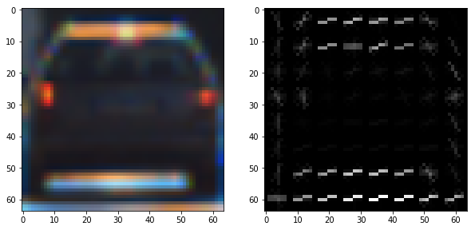
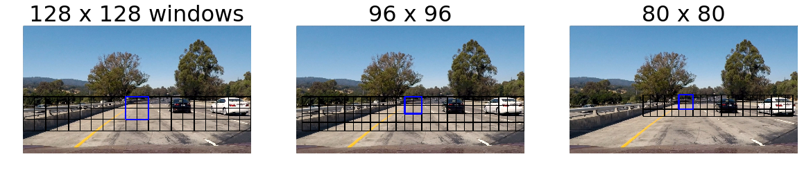
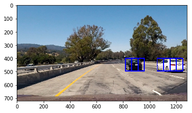
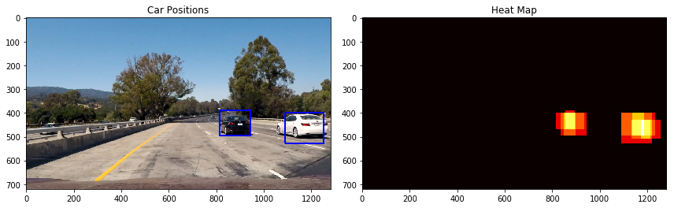
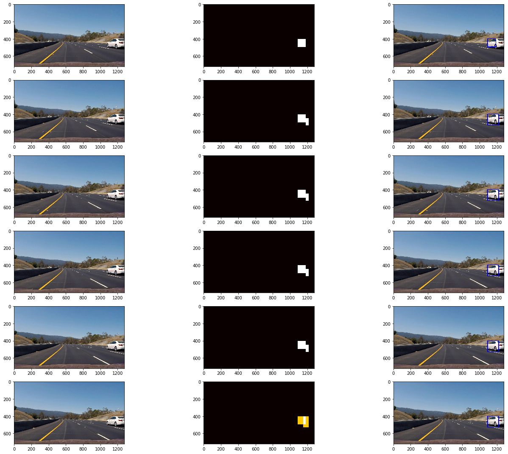

# Vehicle Detection Project

The goals / steps of this project are the following:

* Perform a Histogram of Oriented Gradients (HOG) feature extraction on a labeled training set of images and train a classifier Linear SVM classifier
* Optionally, you can also apply a color transform and append binned color features, as well as histograms of color, to your HOG feature vector. 
* Note: for those first two steps don't forget to normalize your features and randomize a selection for training and testing.
* Implement a sliding-window technique and use your trained classifier to search for vehicles in images.
* Run your pipeline on a video stream (start with the test\_video.mp4 and later implement on full project\_video.mp4) and create a heat map of recurring detections frame by frame to reject outliers and follow detected vehicles.
* Estimate a bounding box for vehicles detected.

## [Rubric][1] Points 
### Here I will consider the rubric points individually and describe how I addressed each point in my implementation.  

---
### Writeup / README

#### 1. Provide a Writeup / README that includes all the rubric points and how you addressed each one.  You can submit your writeup as markdown or pdf. Here is a template writeup for this project you can use as a guide and a starting point.  

You're reading it!

### Histogram of Oriented Gradients (HOG)

#### 1. Explain how (and identify where in your code) you extracted HOG features from the training images.

I started by reading in all the `vehicle` and `non-vehicle` images. I then explored different color spaces and different `skimage.hog()` parameters (`orientations`, `pixels_per_cell`, and `cells_per_block`). Here is an example using the `YCrCb` color space and HOG parameters of `orientations=9`, `pixels_per_cell=(8, 8)` and `cells_per_block=(1, 1)`:

#### 2. Explain how you settled on your final choice of HOG parameters.

I first tried various combinations of parameters to see how the hog picture looks like. I checked to see if the hog picture can display a car shape with little noises. Then I picked some promising parameters and train the model to see which one is good. 

#### 3. Describe how (and identify where in your code) you trained a classifier using your selected HOG features (and color features if you used them).

I trained a linear SVM using with hog features and color features. I used `GridSearchCV` to try different `C` param of linear SVM. Also, I used `train_test_split` to split into 20% test and 80% training set. I also tried SVM with rbf kernel but it doesn't help with the accuracy. 

### Sliding Window Search

#### 1. Describe how (and identify where in your code) you implemented a sliding window search.  How did you decide what scales to search and how much to overlap windows?

The sliding window search part is largely borrowed from the lesson code. First I used the `slide_window` method to get a list of windows to search. Then I used `search_windows` along with the trained model and the list of windows to find which windows contain a vehicle. 

I mainly eyeballed the scales and discussed with peers. I found the scales chosen (128, 96, 80) are good enough to frame a car in different "distances" in the image. Here's an example:

#### 2. Show some examples of test images to demonstrate how your pipeline is working.  What did you do to optimize the performance of your classifier?

Like mentioned previously, I used both color features (I found YCrCb gives the best result) and hog features plus spatially binned color and histograms of color in the feature vector. Here are some example images:

---

### Video Implementation

#### 1. Provide a link to your final video output.  Your pipeline should perform reasonably well on the entire project video (somewhat wobbly or unstable bounding boxes are ok as long as you are identifying the vehicles most of the time with minimal false positives.)

Here's the video: [video](./project_video_result.mp4)

#### 2. Describe how (and identify where in your code) you implemented some kind of filter for false positives and some method for combining overlapping bounding boxes.

I used the heatmap method from the lesson to help filter out false positives. Basically, I first get all hot boxes (windows with vehicles) and create heatmap of a frame. Then for each heatmap, I applied a threshold of one to filter out "fake" heat areas, which may corresponding to false positives. Then I used `scipy.ndimage.measurements.label()` to identify individual blobs in the heatmap and draw bounding boxes around them. Those blobs are vehicles predicted by the trained model. I also used the method to average recent frames to smooth the bounding boxes and deal with missing detections.

Here's an example result:

### Here are six frames and their corresponding heatmaps and bounding boxes drawn:

---

### Discussion

#### 1. Briefly discuss any problems / issues you faced in your implementation of this project.  Where will your pipeline likely fail?  What could you do to make it more robust?

The main issue I faced and and spent the most time on is the feature and param tweaking. I tried many combinations of params of hog feature, color spaces, and spatial feature. Also tried many window sizes to see which ones are good enough to fit vehicles. The project video is rather simple due to a small number of vehicles on the road, constant lightings and stable frames. So in real world, my pipeline will likely to fail in situations like: changes in lighting, vehicles that the trained model doesn't recognize, front facing vehicles (unlikely but possible in messy real world), and many vehicle-like objects detected (false positives). To make it more robust, I used several methods:

1. tweaking params a lot and trying different features in order to detect vehicles as accurate as possible. E.g. I used all of hog, color, and spatial features. For color space, I picked YCrCb instead of the default RGB because it gave better result. 
2. storing the last 5 reliable detection to calculate the average to smooth the bounding boxes

I would like to try deep learning method to see if it could be more robust.

